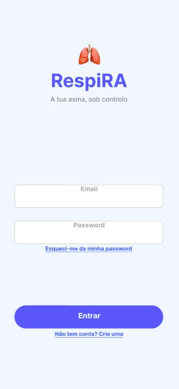

## Documentos

- [eCRF RespiRA (PDF)](files/eCRF_RespiRA.pdf)
- [Dicionário de Dados (CSV)](files/DicionarioDadosRespiRA.csv)

## Instrumentos de Recolha de Dados

Os dados do estudo RespiRA são recolhidos através de um eCRF (Electronic Case Report Form)
implementado na plataforma REDCap. O formulário está organizado nas seguintes secções:

---

## Dados Base

Recolhidos no momento de inclusão de cada participante:

**Informação Administrativa:** ID do participante, consentimento informado, data de
consentimento, centro de saúde/USF e grupo de randomização (Intervenção/Controlo).

**Dados Sociodemográficos:** Data de nascimento, idade, sexo, habilitações literárias,
situação profissional, hábitos tabágicos, altura, peso e IMC.

**Dados Clínicos de Asma:** Data do diagnóstico, gravidade da asma, medicação baseline
(ICS/LABA e SABA), outras medicações relevantes e comorbilidades.

**Literacia Digital:** Posse de smartphone e experiência prévia com apps de saúde.

---

## Dados de Avaliação

Recolhidos na Baseline (Semana 0) e nas semanas 4, 8 e 12:

### ACT - Asthma Control Test

Questionário validado com 5 perguntas sobre o controlo da asma nas últimas 4 semanas:

1. Limitação nas atividades habituais por causa da asma
2. Frequência de falta de ar
3. Sintomas noturnos (tosse, falta de ar, aperto no peito)
4. Utilização do inalador SOS
5. Avaliação global do controlo da asma

**Pontuação total (5-25):** 5-19 asma não controlada; 20-24 asma bem controlada;
25 asma completamente controlada.

### Peak Flow Diário

Registo diário do débito expiratório máximo (L/min), com medições de manhã e
tarde/noite (melhor de 3 medições). Inclui ainda registo de sintomas diários e número
de doses SOS utilizadas.

---

## Adesão à Medicação

Avaliada nas semanas 4, 8 e 12, incluindo:

- Número de doses previstas e tomadas no período
- Taxa de adesão (%)
- Categoria de adesão
- Motivos de falta de adesão (esquecimento, efeitos secundários, melhoria dos sintomas, custo)
- Escala MMAS-4 (4 perguntas sobre comportamentos de adesão)

---

## Outcomes Secundários

Avaliados nas semanas 4, 8 e 12:

**Exacerbações:** Número de exacerbações no período.

**Utilização de Serviços:** Número de idas às urgências, internamentos hospitalares e
consultas não programadas motivadas por asma.

**AQLQ - Asthma Quality of Life Questionnaire:** 4 perguntas sobre qualidade de vida
relacionada com a asma nas últimas 4 semanas, com score total de 1 a 6.

---

## Satisfação

**Satisfação com a App RespiRA** (grupo intervenção): avalia facilidade de utilização,
utilidade para controlo da asma, utilidade dos lembretes e do plano de ação, e
recomendação a outros doentes.

**Satisfação Geral com os Cuidados** (ambos os grupos): avalia a satisfação com os
cuidados recebidos na USF/centro de saúde.

## Protótipo da Aplicação RespiRA

O protótipo interativo da aplicação RespiRA foi desenvolvido no Figma e pode ser
consultado através do link abaixo:

[Protótipo Figma da App RespiRA](https://www.figma.com/proto/vb7pMV9MP5gJiWyRjz5NB5/App-RespiRA?node-id=5-25&t=UQn8K596IYwuxoI2-1)

---

## Relatório da Entrega 2

O relatório completo da Entrega 2, incluindo a descrição do eCRF, decisões de
implementação no REDCap e limitações identificadas, está disponível para download:

[Relatório E2 (PDF)](files/relatorioFP_entrega2 (1).pdf)

---