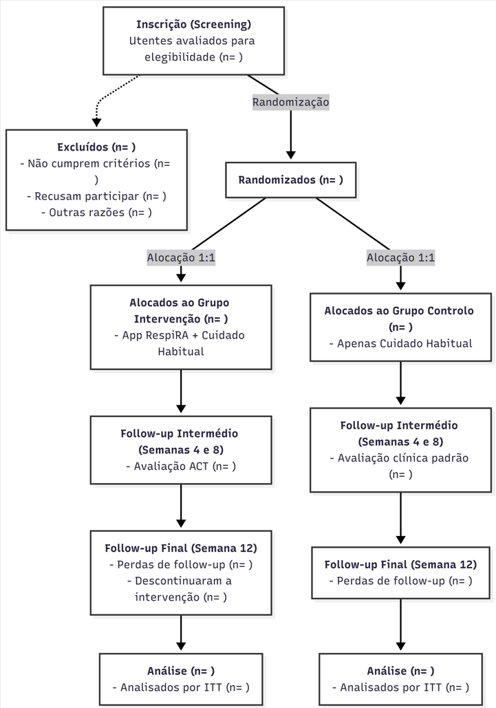
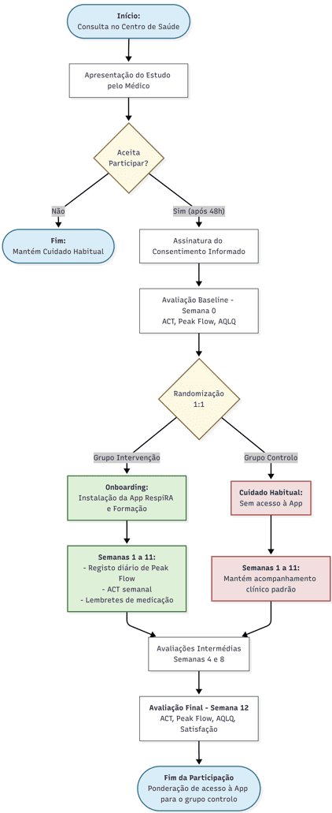
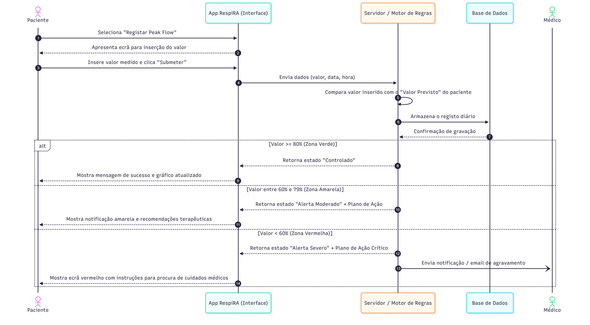
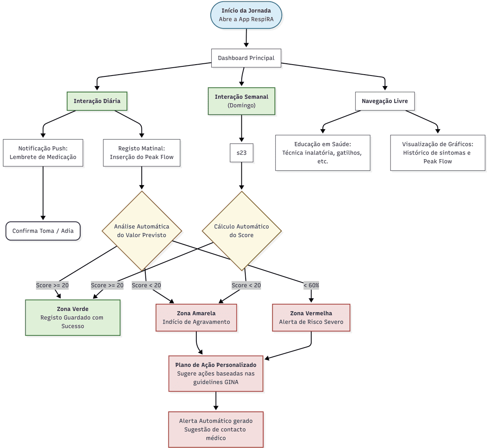
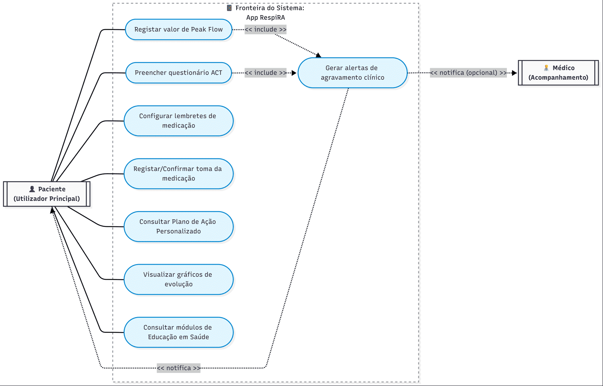

## Introdução

### Racional

A asma é uma doença respiratória crónica de elevada prevalência a nível mundial, afetando cerca de 300 milhões de pessoas, com impacto significativo na qualidade de vida, produtividade e utilização de recursos de saúde. Em Portugal, estima-se que aproximadamente 10% da população adulta sofra de asma, sendo a asma moderada persistente uma das formas clínicas que maior desafio representa para os cuidados de saúde primários.

Apesar dos avanços terapêuticos disponíveis, um número considerável de doentes mantém um controlo subótimo da doença, frequentemente associado a dificuldades na adesão à medicação, desconhecimento do plano de ação individualizado e ausência de monitorização sistemática dos sintomas entre consultas.

A evidência científica recente tem demonstrado o potencial das intervenções baseadas em tecnologias móveis na gestão de doenças crónicas. Contudo, a maioria dos estudos existentes apresenta limitações metodológicas e ausência de validação em contexto de cuidados de saúde primários europeus.

O presente estudo piloto justifica-se pela necessidade de gerar evidência preliminar sobre a viabilidade e eficácia da app RespiRA em adultos com asma moderada persistente seguidos em unidades de saúde familiar (USF) portuguesas.

### Objetivos

**Objetivo Primário:** Avaliar a eficácia da aplicação RespiRA na melhoria do controlo da asma, medida pelo score do Asthma Control Test (ACT) após 12 semanas de intervenção.

**Objetivos Secundários:**

1. Analisar as variações nos valores de pico de fluxo expiratório (peak flow) ao longo do período de intervenção.
2. Determinar a frequência de exacerbações asmáticas durante o estudo.
3. Avaliar a taxa de adesão à medicação prescrita entre os dois grupos.
4. Mensurar a qualidade de vida dos participantes através do AQLQ antes e após a intervenção.

---

## Desenho do Estudo

Ensaio clínico randomizado, controlado, de grupos paralelos, com randomização 1:1, durante 12 semanas, numa Unidade de Saúde Familiar (USF).

**Tipo de estudo:** Ensaio clínico randomizado, controlado, paralelo

**Randomização:** 1:1 (intervenção : controlo)

**Duração:** 12 semanas

**Setting:** 1 Unidade de Saúde Familiar (USF)

**Tamanho da amostra:** 30 participantes (15 por braço)

### Calendarização

| Fase | Duração | Descrição |
|------|---------|-----------|
| Recrutamento | 2 semanas | Identificação e seleção de participantes |
| Baseline | 1 dia | Avaliação inicial e randomização |
| Intervenção | 8 semanas | Período ativo de intervenção |
| Follow-up | 1 semana | Avaliações de outcome |

### Fluxograma CONSORT

---

## População do Estudo

### Critérios de Inclusão

Serão elegíveis indivíduos que cumpram **todos** os seguintes critérios:

1. Idade entre 18 e 65 anos à data de recrutamento
2. Diagnóstico de asma moderada persistente confirmado pelos critérios GINA, documentado há pelo menos 6 meses
3. ACT score entre 12 e 19 pontos e peak flow entre 60-80% do valor previsto, sem hospitalização nos 3 meses anteriores
4. Posse e utilização autónoma de smartphone Android (>=8.0) ou iOS (>=13) com acesso a internet
5. Capacidade de ler e compreender informação escrita em português europeu
6. Capacidade para fornecer consentimento informado escrito
7. Disponibilidade para participar durante 12 semanas

### Critérios de Exclusão

Serão excluídos indivíduos que apresentem **qualquer** dos seguintes critérios:

1. Diagnóstico de DPOC, fibrose quística ou outra doença respiratória crónica grave
2. Participação simultânea noutro ensaio clínico ou estudo intervencionista
3. Gravidez confirmada ou amamentação à data de recrutamento
4. Incapacidade física ou cognitiva de realizar corretamente a medição de peak flow ou preencher o ACT
5. Ausência de smartphone compatível ou sem acesso regular a internet
6. Qualquer condição clínica, psiquiátrica ou social que comprometa a segurança do participante ou a validade dos dados

### Recrutamento

O recrutamento será realizado na USF participante através de duas vias:

**Identificação ativa:** o médico de família identifica, na sua lista de utentes, pacientes com diagnóstico de asma moderada persistente registado no processo clínico eletrónico.

**Recrutamento em consulta:** durante consultas programadas de vigilância ou de doença crónica.

Os candidatos receberão informação escrita sobre o estudo e terão um período mínimo de 48 horas para decidir a sua participação antes de assinar o consentimento informado.

### Percurso do Participante

---

## Intervenções

### Grupo de Intervenção

Os participantes randomizados para o grupo de intervenção receberão a aplicação RespiRA no momento da avaliação basal (T0), com sessão de formação de 15 minutos.

**Funcionalidades principais:**

**Monitorização de sintomas (ACT):** Questionário ACT com 5 perguntas sobre controlo da asma. Frequência semanal com notificação ao domingo.

**Registo de peak flow:** Introdução manual dos valores, com gráficos de evolução e avisos caso o valor desça abaixo de 60% do previsto. Frequência diária, preferencialmente de manhã.
#### Diagrama de Sequência

**Lembretes de medicação:** Notificações push nos horários definidos para cada medicamento prescrito, com opção de confirmar ou adiar a toma.

**Plano de ação e Educação:** Sugestões baseadas nas guidelines GINA e módulos informativos sobre asma.

### Instalação e Onboarding

Após confirmação de elegibilidade e assinatura do consentimento informado, os participantes
do grupo de intervenção receberão, na consulta basal (T0), um código de acesso único para
download da aplicação RespiRA através da App Store ou Google Play.

O processo de onboarding decorrerá na própria consulta e inclui:

1. **Instalação assistida:** um elemento da equipa de investigação apoia o participante na
instalação e criação de conta, garantindo o correto funcionamento no dispositivo pessoal.
2. **Configuração inicial:** introdução dos dados clínicos base (medicação prescrita, horários
de toma, valor de peak flow previsto), com apoio do investigador.
3. **Tutorial guiado:** a app apresenta um tutorial interativo de aproximadamente 10 minutos,
percorrendo todas as funcionalidades principais com instruções passo a passo.
4. **Esclarecimento de dúvidas:** no final, o participante tem a oportunidade de colocar
questões à equipa antes de sair da consulta.

Será disponibilizado um guia de utilização em papel como suporte adicional.

### Suporte Técnico

Os participantes terão acesso a suporte técnico durante todo o período do estudo:

**Linha de apoio telefónico:** disponível de segunda a sexta, das 9h às 17h.

**Email de suporte:** para questões não urgentes, com resposta garantida em até 48 horas úteis.

**FAQ integrado na app:** secção de perguntas frequentes acessível diretamente na aplicação.

Em caso de perda ou substituição de dispositivo, o participante poderá reinstalar a app e
recuperar os seus dados através das credenciais de acesso criadas no onboarding.

#### Diagrama de Atividade da Aplicação

#### Casos de Uso

### Grupo Controlo

Os participantes randomizados para o grupo controlo receberão cuidado habitual isolado, sem acesso à aplicação RespiRA, incluindo consultas médicas programadas, acesso à medicação prescrita e material educativo standard. Após o término do ensaio, será ponderado o acesso à aplicação como medida de equidade.

### Critérios de Descontinuação

Participantes serão retirados do estudo se:

1. Retirarem o consentimento informado em qualquer momento
2. Desenvolverem uma condição clínica que torne a continuação insegura
3. Ocorrer violação grave do protocolo que comprometa a integridade dos dados

---

## Avaliações e Outcomes

### Outcome Primário

**Pontuação do Asthma Control Test (ACT)**

O Asthma Control Test (ACT) é um questionário validado, auto-administrado, composto por
5 perguntas que avaliam o controlo da asma nas últimas 4 semanas. A pontuação varia entre
5 (controlo muito mau) e 25 (controlo total).

**Momento de avaliação:** Baseline (semana 0) e follow-up às 4, 8 e 12 semanas.

**Definição de sucesso:** Diferença estatisticamente significativa na variação da pontuação
média do ACT entre grupos às 12 semanas, ou ACT >= 20 no grupo de intervenção, ou
aumento >= 3 pontos face à linha de base.

### Outcomes Secundários

1. **Valores de Peak Flow (PEF):** Avaliação da média e variabilidade diária ao longo das
12 semanas, calculada pela seguinte fórmula:

$$Variabilidade (\%) = \frac{PEF_{max} - PEF_{min}}{\frac{PEF_{max} + PEF_{min}}{2}} \times 100$$

2. **Taxa de Exacerbações:** Número de exacerbações documentadas durante 12 semanas.
3. **Taxa de Adesão à Medicação:** Percentagem de doses tomadas face às prescritas,
avaliada aos 4, 8 e 12 semanas.
4. **Qualidade de Vida (AQLQ):** Aplicado na baseline e às 12 semanas.
5. **Recurso a Cuidados Não Programados:** Número de idas ao serviço de urgência
motivadas por agravamento da asma.
6. **Satisfação com os Cuidados de Saúde:** Avaliado através de questionário padronizado
na semana 12.

---

## Análise Estatística

### Princípios Gerais

Atendendo à natureza de estudo piloto com uma amostra de 30 participantes, a análise
estatística será essencialmente exploratória e descritiva. O foco principal será a estimação
da magnitude do efeito e os respetivos intervalos de confiança.

**Nivel de significancia:** alfa = 0,05 (bicaudal)

**Software:** R (versao >= 4.0)

### Métodos de Análise

**Outcome primário e secundários:** Teste t de Student para amostras independentes (se
distribuição normal) ou Teste U de Mann-Whitney (se não normal).

**Medidas repetidas:** Modelo Linear de Efeitos Mistos (LMM), incluindo tempo, grupo e
interação tempo x grupo como efeitos fixos.

**Taxa de adesão:** Teste Qui-Quadrado de Pearson ou Teste Exato de Fisher.

**Dados de contagem:** Modelos de regressão de Poisson.

### População de Análise

A análise primária será realizada por **Intention-to-Treat (ITT)**, em que todos os
participantes randomizados serão analisados nos grupos para os quais foram originalmente
alocados. Será realizada uma análise **Per-Protocol (PP)** de sensibilidade.

---

## Ética e Disseminação

O protocolo será submetido para aprovação pela Comissão de Ética para a Saúde (CES). O estudo cumprirá a Declaração de Helsínquia e as Boas Práticas Clínicas (GCP).

A recolha e armazenamento dos dados respeitarão o RGPD, com pseudonimização dos participantes através de código único.

Os resultados serão submetidos para publicação em revistas científicas com revisão por pares e apresentados em congressos médicos, independentemente da direção dos resultados.

## Referências Bibliográficas

1.  Global Initiative for Asthma (GINA). Global Strategy for Asthma Management and Prevention. (2023).
2.  Chan AW, et al. SPIRIT 2013 statement: defining standard protocol items for clinical trials. Ann Intern Med. 2013.
3.  Eldridge SM, et al. Defining feasibility and pilot studies in preparation for randomised controlled trials. PLoS One. 2016.
4.  Hui CY, et al. The use of mobile applications to support self-management for people with asthma. J Am Med Inform Assoc. 2017.
5.  Nathan RA, et al. Development of the asthma control test. J Allergy Clin Immunol. 2004.
6.  Juniper EF, et al. Evaluation of impairment of health related quality of life in asthma. Thorax. 1992.
